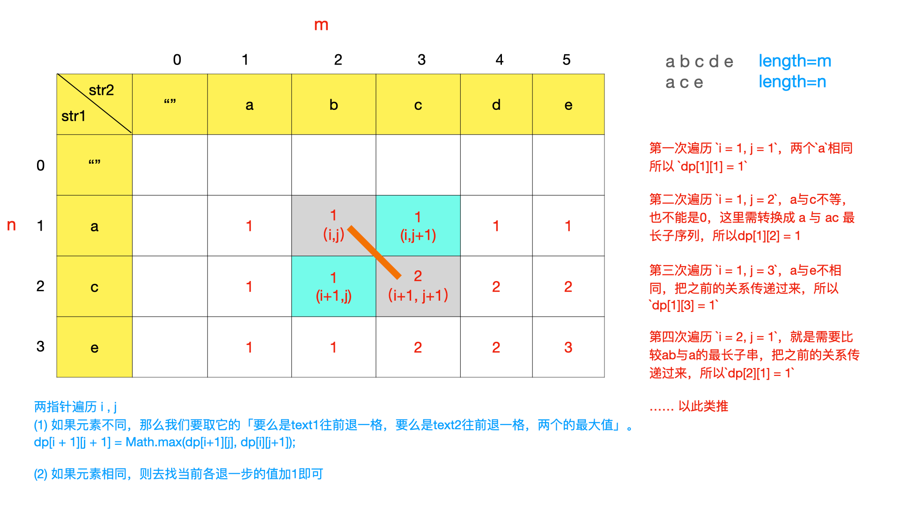

# 字符串

## 常用代码

```shell
String.length()
String.trim()
String.split()
String.length()
String.chatAt()
String.toCharArray()
String.join()
String.substring()
String.indexOf()
String.toLowerCase()
String.toUpperCase()
String.replace()
String.equals()
Stirng.equalsIgnoreCase()
String.startWith()
String.endWith()
String.contain()

Character.isLetter()
Character.isDigit()
Character.isLetterOrDigit()

StringBuilder

```

## 字符串基础问题

| ID     | 名称                                 | 难度      | URL                                                                                                                                          |
| ------ | ----------------------------------- | --------- | ---------------------------------------------------------------------------------------------------------------------------------------------|
| 709    | 转换成小写字母                         | 简单      | https://leetcode.cn/problems/to-lower-case/                                                                                                                                                        |
| 58     | 最后一个单词的长度                      | 简单      | https://leetcode.cn/problems/length-of-last-word/                                                                                                                                                        |
| 771    | 宝石与石头                             | 简单      | https://leetcode.cn/problems/jewels-and-stones/                                                                                                                                                        |
| 387    | 字符串中的第一个唯一字符                 | 简单      | https://leetcode.cn/problems/first-unique-character-in-a-string/                                                                                                                                                        |
| 8      | 字符串转换整数 (atoi)                  | 中等      | https://leetcode.cn/problems/string-to-integer-atoi/                                                                                                                                                        |

## 字符串操作问题

| ID     | 名称                                 | 难度      | URL                                                                                                                                          |
| ------ | ----------------------------------- | --------- | ---------------------------------------------------------------------------------------------------------------------------------------------|
| 14     | 最长公共前缀                         | 简单      | https://leetcode.cn/problems/longest-common-prefix/                                                                                                                                                       |
| 344    | 反转字符串                          | 简单      | https://leetcode.cn/problems/reverse-string/                                                                                                                                                      |
| 541    | 反转字符串 II                       | 简单      | https://leetcode.cn/problems/reverse-string-ii/                                                                                                                                                     |
| 151    | 反转字符串中的单词                    | 中等      | https://leetcode.cn/problems/reverse-words-in-a-string/                                                                                                                                                   |
| 557    | 反转字符串中的单词 III                | 简单      | https://leetcode.cn/problems/reverse-words-in-a-string-iii/                                                                                                                                                   |
| 917    | 仅仅反转字母                         | 简单      | https://leetcode.cn/problems/reverse-only-letters/                                                                                                                                                   |

## 异位词问题

| ID     | 名称                                 | 难度      | URL                                                                                                                                          |
| ------ | ----------------------------------- | --------- | ---------------------------------------------------------------------------------------------------------------------------------------------|
| 242    | 有效的字母异位词                       | 简单      | https://leetcode.cn/problems/valid-anagram/                                                                                                                                                       |
| 49     | 字母异位词分组有                       | 中等      | https://leetcode.cn/problems/group-anagrams/                                                                                                                                                       |
| 438    | 找到字符串中所有字母异位词               | 中等      | https://leetcode.cn/problems/find-all-anagrams-in-a-string/                                                                                                                                                       |


## 回文串问题

| ID     | 名称                                 | 难度      | URL                                                                                                                                          |
| ------ | ----------------------------------- | --------- | ---------------------------------------------------------------------------------------------------------------------------------------------|
| 125    | 验证回文串                            | 简单      | https://leetcode.cn/problems/valid-palindrome/                                                                                                                                                      |
| 680    | 验证回文串 II                         | 简单      | https://leetcode.cn/problems/valid-palindrome-ii/                                                                                                                                                    |
| 5      | 最长回文子串                           | 中等      | https://leetcode.cn/problems/longest-palindromic-substring/                                                                                                                                                    |

## 最长子串、子序列问题

| ID     | 名称                                 | 难度      | URL                                                                                                                                          |
| ------ | ----------------------------------- | --------- | ---------------------------------------------------------------------------------------------------------------------------------------------|
| 1143    | 最长公共子序列                          | 中等      | https://leetcode.cn/problems/longest-common-subsequence/                                                                                                                                                      |

### 1143. 最长公共子序列

最长公共子序列（Longest Common Subsequence，简称 LCS）是一道非常经典的面试题目，因为它的解法是典型的二维动态规划，大部分比较困难的字符串问题都和这个问题一个套路，比如说编辑距离。而且，这个算法稍加改造就可以用于解决其他问题，所以说 LCS 算法是值得掌握的。

题目就是让我们求两个字符串的 LCS 长度：
```shell
输入: str1 = "abcde", str2 = "ace" 
输出: 3  
解释: 最长公共子序列是 "ace"，它的长度是 3
```
- 动态规划思路

1. 第一步，一定要明确 dp 数组的含义。对于两个字符串的动态规划问题，套路是通用的。


为了方便理解此表，我们暂时认为索引是从 1 开始的，待会的代码中只要稍作调整即可。其中，dp[i][j] 的含义是：对于 s1[1..i] 和 s2[1..j]，它们的 LCS 长度是 dp[i][j]。

比如上图的例子，d[2][4] 的含义就是：对于 "ac" 和 "babc"，它们的 LCS 长度是 2。我们最终想得到的答案应该是 dp[3][6]。

2. 第二步，定义 base case。

我们专门让索引为 0 的行和列表示空串，dp[0][..] 和 dp[..][0] 都应该初始化为 0，这就是 base case。

比如说，按照刚才 dp 数组的定义，dp[0][3]=0 的含义是：对于字符串 "" 和 "bab"，其 LCS 的长度为 0。因为有一个字符串是空串，它们的最长公共子序列的长度显然应该是 0。


3. 第三步，找状态转移方程。

这是动态规划最难的一步，不过好在这种字符串问题的套路都差不多，权且借这道题来聊聊处理这类问题的思路。

状态转移说简单些就是做选择，比如说这个问题，是求 s1 和 s2 的最长公共子序列，不妨称这个子序列为 lcs。那么对于 s1 和 s2 中的每个字符，有什么选择？很简单，两种选择，要么在 lcs 中，要么不在。



* 第一次遍历 i = 1, j = 1，两个a相同所以 dp[1][1] = 1
* 第二次遍历 i = 1, j = 2，a与c不等，也不能是0，这里需转换成 a 与 ac 最长子序列，这里需要把之前的关系传递过来，所以dp[1][2] = 1
* 第三次遍历 i = 1, j = 3，a与e不相同，把之前的关系传递过来，所以dp[1][3] = 1

text2：ace 已经走完来第一轮，接下来text1：abcde 走到来b字符。

我们会发现遍历两个串字符，当不同时需要考虑两层遍历前面的值（关系传递），也就是左边和上边的其中较大的值，当想相同时，需要考虑各自不包含当前字符串的子序列长度，再加上1。

因此可以得出：
现在对比的这两个字符不相同的，那么我们要取它的「要么是text1往前退一格，要么是text2往前退一格，两个的最大值」
dp[i + 1][j + 1] = Math.max(dp[i+1][j], dp[i][j+1]);

对比的两个字符相同，去找它们前面各退一格的值加1即可：dp[i+1][j+1] = dp[i][j] + 1;

参考代码
```java
public class LongestCommonSubsequence {

    public int longestCommonSubsequence(String text1, String text2) {
        int m = text1.length(), n=text2.length();
        int[][] dp = new int[m + 1][n + 1];
        for (int i = 1; i <= m; i++) {
            for (int j = 1; j <= n; j++) {
                if (text1.charAt(i-1) == text2.charAt(j-1)) {
                    dp[i][j] = dp[i-1][j-1] +1;
                } else {
                    dp[i][j] = Math.max(dp[i - 1][j], dp[i][j - 1]);
                }
            }
        }
        return dp[m][n];
    }
}

```

4. reference
* https://leetcode.cn/problems/longest-common-subsequence/solution/dong-tai-gui-hua-zhi-zui-chang-gong-gong-zi-xu-lie/
* https://leetcode.cn/problems/longest-common-subsequence/solution/dong-tai-gui-hua-tu-wen-jie-xi-by-yijiaoqian/


## 字符串 + DP 问题


## reference
* https://xiaochen1024.com/series/6196129fc1553b002e57bef5
* https://gitee.com/Doocs/leetcode

